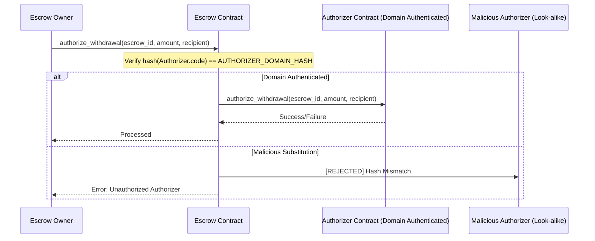

# Authorization Domain Boundary Invariant

## Overview
This document describes the security model for cross-contract authorization in the Escrow protocol. To prevent unauthorized withdrawal drawing via look-alike contracts, the protocol enforces a strict domain boundary check on all external authorizer calls.

## Authorization Flow Diagram

## State Invariants

### 1. Authorizer Immutability
Once an escrow has locked funds, the authorizer contract ID cannot be changed. This prevents an attacker from substituting a malicious authorizer after deposits have been made.
- **Invariant:** `escrow.total_locked > 0 => authorizer == initial_authorizer`

### 2. Domain Identity
Every authorizer call must be preceded by a validation of the authorizer's WASM code hash against the registered `AUTHORIZER_DOMAIN_HASH`.
- **Invariant:** `invoke(authorizer) => hash(authorizer.code) == AUTHORIZER_DOMAIN_HASH`

### 3. Rate Limiting
Withdrawals are subject to a maximum rate per epoch to mitigate the impact of any single authorized withdrawal.
- **Invariant:** `withdrawal.amount <= MAX_WITHDRAWAL_RATE * escrow.total_locked`
- **Epoch:** 3600 seconds

## Parameters
- `ESCROW_MIN_LOCK_DURATION`: 86400 seconds (24 hours)
- `MAX_WITHDRAWAL_RATE`: 10%
- `WITHDRAWAL_EPOCH`: 3600 seconds
