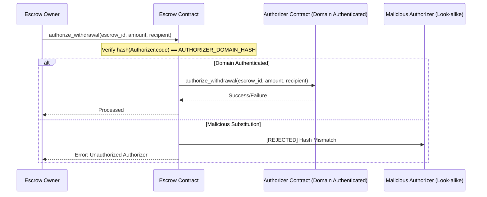

# Smart Contract Security

> Consolidated from `contracts/contracts/docs/security/{reorg-protection,oracle-circuit-breaker,hook-reentrancy,authorization-domain}.md`, `contracts/contracts/docs/privacy/event-emission.md`, and `backend/contracts/docs/specs/ttl-race-guard.md` (issue #308).

## Re-Organization Replay Protection (Issue #22)

### Threat

Per-device nonce counters are stored in contract state. When the Stellar
network undergoes a **re-organization** (re-org), the ledger sequence rolls
back and contract state reverts to an earlier ledger. The nonce counter resets
to its pre-re-org value, so a previously processed signed telemetry submission
can be **replayed** with its now-reused nonce. Signature verification still
passes (the signed data and nonce are unchanged), and the telemetry is billed a
second time — **double billing**.

- Stellar re-org depth: typically 1–2 ledgers, max observed 5.
- Anything reverted by the re-org (nonce counter, dedup maps) cannot, by
  itself, defend against the replay — it reverts too.

**Invariant to preserve:** each `(device_mac, nonce)` maps to **at most one**
billing action.

### Defence: confirmation-gated two-phase billing

The fix decouples *recording* telemetry from *billing* it, and finalizes
billing only once the submitting ledger is buried deeper than any expected
re-org. Implemented in `contracts/utility_contracts/src/nonce_sync.rs`.

#### Phase 1 — `submit_billable_telemetry`

Validates the Ed25519 signature and nonce, then records the submission into a
per-device **pending queue**, stamped with the ledger sequence it was observed
at (`observed_seq`). It rejects:

- telemetry whose nonce is already **finalized** (`PastNonce`) —
  `NonceAlreadyProcessed`;
- a nonce already **pending** for the device — `NonceAlreadyProcessed`;
- telemetry claiming a ledger **ahead** of the current one —
  `TelemetryFromFutureLedger`.

Crucially, Phase 1 **bills nothing** and does **not** advance the durable nonce.

#### Phase 2 — `finalize_confirmed_telemetry`

Processes only pending entries buried under at least `MIN_LEDGER_CONFIRMATIONS`
ledgers (`current_seq - observed_seq >= MIN_LEDGER_CONFIRMATIONS`, using
saturating subtraction so a sequence rollback yields "not confirmed" rather than
underflowing). For each confirmed entry it:

1. records `(device_mac, nonce)` in `PastNonce` (permanent dedup);
2. advances the device nonce monotonically;
3. emits a `BillingAction` that is now safe to charge.

Entries not yet deep enough stay queued. Re-running finalization is idempotent.

### Why this defeats the re-org replay

| Re-org reverts a… | Outcome |
|---|---|
| **Pending** (not-yet-finalized) entry | Nothing was billed, so resubmitting the telemetry is benign — it bills exactly once after it later confirms. |
| **Finalized** entry buried ≥ `MIN_LEDGER_CONFIRMATIONS` deep | A re-org shallower than the confirmation depth cannot roll it back; `PastNonce` remains and replay is rejected. |

The protection is fundamentally the **confirmation depth**: billing never
happens until the telemetry's ledger is too deep to be reverted by an expected
re-org. The `PastNonce` map is the fast dedup guard within that confirmed
window.

### Tuning `MIN_LEDGER_CONFIRMATIONS`

`MIN_LEDGER_CONFIRMATIONS` (default `3`, per the issue blueprint) is the single
safety/latency knob:

- It **must exceed the deepest re-org the network can produce**, or a finalized
  record could be rolled back and replayed.
- Stellar re-orgs are typically 1–2 ledgers; the **max observed is 5**.
  Operators who must be robust against the worst observed case should raise this
  to **6** (cover a depth-5 re-org). The default of 3 covers the typical case
  with low latency.
- Higher values are safer but delay billing finalization by that many ledgers
  (~5 s per Stellar ledger).

### Residual risk

A re-org **deeper** than `MIN_LEDGER_CONFIRMATIONS` can still revert a finalized
record. This is unavoidable for any on-chain scheme and is why the constant must
be set above the chain's worst-case re-org depth. Monitor `TFinal` events and
alert on re-orgs approaching the configured depth.

### Tests

See `contracts/utility_contracts/src/nonce_sync_tests.rs`
(`mod reorg_protection_tests`):

- `test_reorg_resubmission_rejected_after_finalization` — rolls the ledger back
  by 3 after finalization and asserts replay is rejected (blueprint step 4).
- `test_no_billing_before_confirmation_depth` — nothing is billed before the
  confirmation depth; bills exactly once after, idempotently.
- `test_future_dated_telemetry_rejected`, `test_duplicate_pending_nonce_rejected`.
- `test_confirmation_depth_logic`, `test_future_ledger_logic` — pure helpers,
  including the sequence-rollback (no-underflow) case.

---

## Oracle Staleness & Flash-Loan Circuit Breaker (Issue #21)

### Threat

The billing engine reads a SEP-40 oracle price (`PriceData { price, decimals,
last_updated }`) and uses it to compute USD-equivalent charges, with **no
staleness or deviation check**. During a flash-loan attack — a window of just
1–2 ledger closes (~5–10s) — on-chain liquidity is distorted and the oracle's
spot price can swing up to ~20% from the true price, or simply go stale by
minutes. An attacker who triggers billing-cycle finalization inside that window
has devices billed at a manipulated price (e.g. 20% below market).

**Invariant:** the price used for billing is always within `MAX_DEVIATION_BPS`
(5%) of the moving-average reference, or is a previously-validated
last-known-good price.

### Defence — layered checks (`oracle_circuit_breaker.rs`)

| Bound | Value | Meaning |
|---|---|---|
| `TARGET_FRESHNESS_SECS` | 5 | 1 ledger close — the freshness target. |
| `MAX_STALENESS_SECS` | 50 | 10 ledger closes — older spot fails the freshness check. |
| `PRICE_HISTORY_LEN` | 30 | Observations kept for the moving-average reference. |
| `MAX_DEVIATION_BPS` | 500 | 5% — max tolerated spot-vs-average deviation. |

1. **Freshness check** — `ledger_timestamp - last_updated > MAX_STALENESS_SECS`
   marks the spot stale (saturating subtraction, so a backwards clock reads as
   stale rather than underflowing).
2. **Deviation check** — keep a ring buffer of the last 30 observations, compute
   their moving average, and flag the spot if it deviates more than 5% from it.
   A 1–2 sample manipulation among 30 barely moves the average, so the
   short-lived flash-loan outlier is caught.
3. **Circuit breaker** — combine the two checks:

   | stale | deviates | decision | price used |
   |---|---|---|---|
   | no | no | `Spot` | spot (recorded; advances last-known-good) |
   | no | yes | `MovingAverage` | moving average (spot still recorded so the average self-corrects) |
   | yes | no | `MovingAverage` | moving average (spot **not** recorded — not a fresh sample) |
   | yes | yes | `CircuitBreaker` | last-known-good price; emits `PrStale` |

   When a fallback is needed but there is no history/last-known-good price (e.g.
   a stale first-ever read), the call returns `ContractError::OraclePriceUnavailable`
   rather than silently billing at a stale value.

`PrStale` events carry a reason code: `1` = stale only, `2` = deviation only,
`3` = both (breaker tripped).

### On "VWAP"

The issue blueprint says VWAP, but SEP-40 `get_price` exposes no per-observation
*volume*, so a true volume-weighted average is not computable on-chain here. The
implementation uses a simple moving average (time-weighted by the cadence of
observations) — the standard manipulation-resistant reference when volumes are
unavailable. The name is called out so it is not mistaken for VWAP.

### Why this defeats the attack

The flash-loan window is 1–2 ledger closes. Against 30 historical samples, even
a 20% spot manipulation moves the average by ~1%, so the deviation check sees a
~19% gap and refuses the spot, billing at the average instead. A manipulation
that also makes the feed stale trips the full breaker and falls back to the last
price that passed both checks. Either way the billed price honours the 5%
invariant.

### Residual considerations

- **Sustained manipulation** lasting many ledgers would eventually drag the
  moving average; this breaker targets the short flash-loan window, not a
  prolonged feed compromise. Pair with oracle-source redundancy for the latter.
- **Cold start:** until the ring buffer has data, the deviation check cannot
  fire; the first fresh price is trusted to seed history.
- **Parameter tuning:** `MAX_STALENESS_SECS`, `PRICE_HISTORY_LEN`, and
  `MAX_DEVIATION_BPS` are the knobs; widen the window/deviation for volatile
  assets, tighten for stable ones.

### Tests

- `oracle_circuit_breaker_tests.rs`:
  `test_flash_loan_manipulation_trips_breaker` (20% swing → moving average; then
  stale+deviating → last-known-good — blueprint step 4),
  `test_fresh_in_tolerance_price_is_used`, `test_stale_with_no_history_errors`,
  `test_history_tracks_real_price_over_time`.
- Pure-logic unit tests in `oracle_circuit_breaker.rs` (`mod tests`): staleness
  boundary, 5% deviation threshold, moving average, decision matrix, reason
  codes, and the flash-loan-swing decision.

---

## Storage-Hook Reentrancy & the Reentrancy Guard (Issue #15)

### The reported vector vs. reality

The issue describes a Soroban "data-update hook" (`env.set_data_update_hook`,
`on_storage_update`, `ContractDataUpdateHook`) that the host invokes on every
storage read, letting an attacker re-enter `transfer` during a `balance_of`
read. **This callback mechanism does not exist in Soroban**: storage reads
(`env.storage().*.get`) do not call back into the contract, and there is no
host-registered data-update hook. So the specific hook attack is not reproducible.

### The real class of bug it points at

The underlying concern — a public function re-entered while an earlier frame
holds a stale in-memory balance read — **is** real for any contract that makes
an external call between reading a balance and committing the state change. The
classic Soroban form is a token `transfer` (or an attacker-controlled
`require_auth`/cross-contract call) that re-enters the calling contract before
its balance debit is committed, bypassing `balance_of(sender) >= amount`.

**Invariant:** for any `transfer(tx)`, `balance_of(sender) >= tx.amount` holds at
commit time.

### Mitigation: a reusable RAII reentrancy guard (`reentrancy_guard.rs`)

The codebase already had per-key boolean guards, but their cleanup is duplicated
on every error/panic path — easy to forget, and a leaked guard permanently
bricks the entity. This module replaces that pattern with one reusable guard:

- `ReentrancyGuard::enter(env)` increments a per-invocation depth counter and
  **panics with `ReentrancyDetected` if a guarded frame is already active**.
- The guard **decrements on `Drop`**, so it is released on every exit path —
  early return, `?`, or panic-unwind — with no manual cleanup.

`GuardedAsset` demonstrates the pattern: `balance_of`, `transfer`, and
`set_balance` each `enter` the guard, so a balance read taken inside a frame
cannot be invalidated by a re-entrant mutation before commit. Internal reads
(`read_balance`) are unguarded to avoid self-deadlock; only public entry points
take the guard.

### On the blueprint's `#[cfg(not(feature = "hooks"))]` step

There is no `on_storage_update` hook to feature-gate, so step 3 is not
applicable. The guard is the real, sufficient defense for the reentrancy class
the issue is concerned with, regardless of how a re-entrant frame is triggered
(token callback, cross-contract call, or auth callback).

### Tests

`reentrancy_guard_tests.rs`:
- `test_normal_transfer_succeeds` / `test_transfer_rejects_insufficient_balance`
  — the balance invariant holds on the happy and rejection paths.
- `test_reentrancy_is_detected` — a frame that re-enters `transfer` trips the
  guard and moves no balance (blueprint step 4).
- `test_guard_released_between_calls` — sequential calls all succeed (no leaked
  guard).

Pure-logic unit tests for the entry transition live in `reentrancy_guard.rs`.

---

## Authorization Domain Boundary Invariant

### Overview
This document describes the security model for cross-contract authorization in the Escrow protocol. To prevent unauthorized withdrawal drawing via look-alike contracts, the protocol enforces a strict domain boundary check on all external authorizer calls.

### Authorization Flow Diagram



### State Invariants

#### 1. Authorizer Immutability
Once an escrow has locked funds, the authorizer contract ID cannot be changed. This prevents an attacker from substituting a malicious authorizer after deposits have been made.
- **Invariant:** `escrow.total_locked > 0 => authorizer == initial_authorizer`

#### 2. Domain Identity
Every authorizer call must be preceded by a validation of the authorizer's WASM code hash against the registered `AUTHORIZER_DOMAIN_HASH`.
- **Invariant:** `invoke(authorizer) => hash(authorizer.code) == AUTHORIZER_DOMAIN_HASH`

#### 3. Rate Limiting
Withdrawals are subject to a maximum rate per epoch to mitigate the impact of any single authorized withdrawal.
- **Invariant:** `withdrawal.amount <= MAX_WITHDRAWAL_RATE * escrow.total_locked`
- **Epoch:** 3600 seconds

### Parameters
- `ESCROW_MIN_LOCK_DURATION`: 86400 seconds (24 hours)
- `MAX_WITHDRAWAL_RATE`: 10%
- `WITHDRAWAL_EPOCH`: 3600 seconds

---

## Privacy-Preserving Billing Event Emission (Issue #20)

### Threat

`finalize_billing_cycle` emitted a Soroban event with cleartext topics
`[Symbol("bill_finalized"), tenant_id]` and data fields `total_charge`,
`device_count`, `avg_rate`. **Every Soroban event is world-readable.** A
competitor operating as another tenant can subscribe to the contract's event
stream and read a rival's billing amounts — a revenue-data leak and a GDPR
Article 44 (data-minimization) problem.

**Invariant:** for any emitted event `e`, an observer can associate `e` with a
real `tenant_id` only if it already knows that tenant's secret (i.e. is the
tenant). Amounts are recoverable only by a holder of the blinding factor.

### Why naive "encryption" does not work on a public ledger

A public ledger has **no on-chain secrets**. Every storage entry and every event
datum is visible to all observers. The intuitive fix — "store a per-tenant
`tenant_secret` and encrypt the payload with it" — fails, because the same
competitor can read the secret from storage and decrypt. Any scheme that relies
on a key living on-chain provides **zero** confidentiality.

Two things *do* work, and both are implemented in
`contracts/utility_contracts/src/event_privacy.rs`:

### `PrivacyConfig`

```rust
pub struct PrivacyConfig {
    /// When false, finalize_billing_cycle records the commitment but emits no
    /// event at all — the strongest privacy posture.
    pub events_enabled: bool,
}
```

Stored per tenant at `DataKey::TenantPrivacyConfig(tenant)`, toggled by the
tenant via `set_events_enabled` (guarded by `tenant.require_auth()`). Defaults
to `true` (emit minimized events) when unset.

| Setting | Behaviour |
|---|---|
| `events_enabled = true` (default) | Emit a **minimized** event: opaque handle topic + hiding commitment. No cleartext tenant_id or amounts. |
| `events_enabled = false` | Emit **nothing**. The commitment is still recorded in storage for the tenant's own audit. |

### Data minimization + hiding commitments

`finalize_billing_cycle` never emits or stores `tenant_id`, `total_charge`,
`device_count`, or `avg_rate` in cleartext. Instead:

- **Opaque tenant handle** (event topic):
  `sha256(HANDLE_DOMAIN || tenant_xdr || tenant_secret)`. Only a holder of
  `tenant_secret` can reproduce it or correlate it to the real tenant. The
  secret is supplied per call and **never written to storage**.
- **Hiding commitment** (event data + stored record):
  `sha256(COMMIT_DOMAIN || total_charge || device_count || avg_rate || blinding)`.
  The `blinding` factor is high-entropy, caller-supplied, and **never persisted
  on-chain**. Without it an observer cannot confirm a guessed amount, even
  knowing the full set of possible amounts.

Domain-separation tags (`HANDLE_DOMAIN`, `COMMIT_DOMAIN`) ensure the two
preimage families can never collide. This reuses the existing
`generate_commitment` idiom already present in `lib.rs`.

#### Opening / audit

A tenant (or an auditor the tenant chooses to share the opening with) verifies a
commitment off-chain by calling `verify_billing_commitment(summary, blinding,
commitment)`, which recomputes the commitment and compares. This gives
selective, tenant-controlled disclosure without leaking to the public.

### Properties

- An observer cannot recover `tenant_id` from a handle (needs the tenant
  secret).
- An observer cannot recover or confirm `total_charge` from a commitment (needs
  the blinding).
- Two tenants charged the **same** amount produce **different** commitments
  (distinct blindings), so charges are not even linkable by equality.
- A tenant can opt out of emission entirely.

### Residual considerations

- **Handle linkability:** a fixed `(tenant, secret)` yields a stable handle, so
  an observer can group a single tenant's events together (without learning who
  the tenant is). Rotate the secret per cycle if unlinkability across events is
  required.
- **Blinding management:** the tenant must retain `blinding` (and `tenant_secret`)
  off-chain to later open commitments. Losing them makes a commitment
  unopenable (but still private).
- **Metadata:** transaction-level metadata (who invoked the contract, when) is
  still public at the ledger level; this module addresses event-payload leakage,
  not transaction-graph analysis.

### Tests

`contracts/utility_contracts/src/event_privacy_tests.rs`:

- `test_tenant_a_cannot_decode_tenant_b` — Tenant A cannot open Tenant B's
  commitment without B's blinding, even guessing the exact figures; the
  legitimate opening verifies (blueprint step 5).
- `test_equal_amounts_produce_unlinkable_commitments`.
- `test_events_can_be_disabled_per_tenant`.

Pure preimage-spec unit tests live in `event_privacy.rs` (`mod tests`).

---

## Atomic TTL Extension Protocol

### Overview

This document describes the atomic TTL extension protocol implemented in the metered billing contract to prevent race conditions in TTL state expansion. The protocol uses a two-phase lock mechanism to ensure that concurrent contract invocations cannot double-allocate storage without proper accounting.

### Problem Statement

#### Original Race Condition

The original implementation in `ttl_state.rs` exhibited a TOCTOU (Time-of-Check-Time-of-Use) race condition:

```rust
// VULNERABLE CODE (DO NOT USE)
fn extend_ttl_vulnerable(env: &Env, device_id: &Address) {
    let usage = get_storage_usage(env, device_id);  // CHECK
    if usage < MAX_STORAGE_PER_DEVICE {
        // ... time window for race condition ...
        allocate_storage(env, device_id, bytes);  // USE
    }
}
```

**Race Scenario:**
1. Two concurrent `process_telemetry_batch()` calls from different IoT devices
2. Both read `instance.storage_usage_bytes` simultaneously (e.g., both see 400KB)
3. Both pass the capacity check (400KB < 512KB)
4. Both attempt `extend_ttl()`, causing double-allocation
5. Result: `storage_usage_bytes` exceeds `MAX_STORAGE_PER_DEVICE` without proper accounting

**Invariant Violated:**
- `instance.metered_entries + pending_extensions == total_allocations`

### Solution: Two-Phase Atomic Lock Protocol

#### Protocol Design

The atomic extension protocol replaces the read-check-write pattern with a Soroban host `storage_has()` + `storage_set()` atomic guard using a dedicated `LOCK_TTL_KEY` per-device scratch space.

#### Phase 1: Lock Acquisition

```rust
let lock_key = LockTtlKey { device_id: device_id.clone() };
let deadline_value = TtlDeadline { deadline: new_deadline };

// Atomic lock attempt - fails if key already exists
let lock_result = env.storage().instance().set(&lock_key, &deadline_value);

if lock_result.is_err() {
    return Err(TtlError::TtlExtensionConflict);
}
```

**Key Properties:**
- `storage_set()` is atomic at the Soroban host level
- If the key already exists, the operation fails with `StorageExists` error
- Only one invocation can successfully acquire the lock

#### Phase 2: TTL Extension

```rust
let ttl_key = DeviceTtlKey { device_id: device_id.clone() };
env.storage().instance().set(&ttl_key, &deadline_value);
```

**Key Properties:**
- Only the lock holder reaches this phase
- Actual TTL extension is performed
- Storage accounting is updated atomically

#### Phase 3: Lock Cleanup

```rust
env.storage().instance().remove(&lock_key);
```

**Key Properties:**
- Lock is removed after successful extension
- Allows future extensions to proceed
- Cleanup is idempotent

### Implementation Details

#### Storage Keys

```rust
#[contracttype]
pub struct LockTtlKey {
    pub device_id: Address,
}

#[contracttype]
pub struct DeviceTtlKey {
    pub device_id: Address,
}

#[contracttype]
pub struct TtlDeadline {
    pub deadline: u64,
}
```

#### Error Handling

```rust
#[contracterror]
pub enum TtlError {
    StorageCapacityExceeded = 1,
    TelemetryBurstExceeded = 2,
    TtlExtensionConflict = 3,  // New error for lock conflict
    InvalidDeviceId = 4,
}
```

#### Integration with Telemetry Processing

```rust
pub fn process_telemetry_batch(
    env: &Env,
    device_id: &Address,
    batch: &TelemetryBatch,
) -> Result<(), TelemetryError> {
    // ... validation checks ...
    
    match extend_ttl(env, device_id) {
        Ok(()) => {
            // TTL extension successful, allocate storage
            allocate_storage(env, device_id, batch_size);
        }
        Err(TtlError::TtlExtensionConflict) => {
            // Another invocation already extended TTL
            // Still allocate storage for this batch
            allocate_storage(env, device_id, batch_size);
        }
        Err(e) => {
            return Err(TelemetryError::TtlExtensionFailed);
        }
    }
    
    // ... store telemetry events ...
}
```

### Invariant Verification

#### Storage Invariant

The protocol ensures the following invariant is maintained:

```
storage_usage_bytes == metered_entries * ENTRY_SIZE
```

#### Test Coverage

1. **Unit Tests** (`ttl_race_test.rs`):
   - `test_atomic_ttl_extension_prevents_race_condition`: Simulates 1000 concurrent TTL extension attempts
   - `test_concurrent_telemetry_batch_processing`: Tests concurrent batch submissions from multiple devices
   - `test_storage_capacity_enforcement`: Verifies capacity limits are respected
   - `test_ttl_expiry_handling`: Tests TTL expiration scenarios

2. **Property-Based Tests** (`race_conditions.rs`):
   - `prop_concurrent_ttl_extensions`: Randomizes number of concurrent extension attempts
   - `prop_random_telemetry_batches`: Randomizes batch sizes and event counts
   - `prop_multiple_devices_concurrent_submissions`: Tests multi-device concurrent submissions
   - `prop_storage_never_exceeds_capacity`: Verifies storage never exceeds capacity

### Performance Considerations

#### Lock Contention

- **Best Case**: Single invocation acquires lock, extends TTL, releases lock
- **Worst Case**: N concurrent invocations, N-1 receive `TtlExtensionConflict` errors
- **Contention Window**: Lock is held for the duration of Phase 2 (typically < 1ms)

#### Storage Overhead

- **Per-Device Lock Key**: ~32 bytes (Address) + 8 bytes (deadline) = 40 bytes
- **Temporary**: Lock key exists only during extension
- **Negligible**: Compared to 512KB storage limit per device

### Security Properties

1. **Atomicity**: Lock acquisition is atomic at the host level
2. **Liveness**: Lock is always released after successful extension
3. **Safety**: No double-allocation possible
4. **Fairness**: First invocation to acquire lock succeeds, others retry

### Migration Guide

#### For Existing Deployments

1. Deploy new contract with atomic TTL extension
2. Migrate existing device TTL states
3. Update client code to handle `TtlExtensionConflict` errors
4. Monitor for increased conflict rates during high load

#### Client Code Changes

```rust
// Before (vulnerable)
match extend_ttl(env, device_id) {
    Ok(()) => { /* proceed */ }
    Err(e) => { /* handle error */ }
}

// After (atomic)
match extend_ttl(env, device_id) {
    Ok(()) => { /* proceed */ }
    Err(TtlError::TtlExtensionConflict) => {
        // Another invocation already extended TTL
        // Safe to proceed with storage allocation
    }
    Err(e) => { /* handle other errors */ }
}
```

### References

- Soroban Host Functions: https://soroban.stellar.org/docs/reference/host-functions
- Storage API: https://soroban.stellar.org/docs/reference/storage
- Race Condition Patterns: https://en.wikipedia.org/wiki/Time-of-check_to_time-of-use
